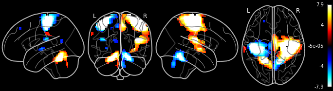
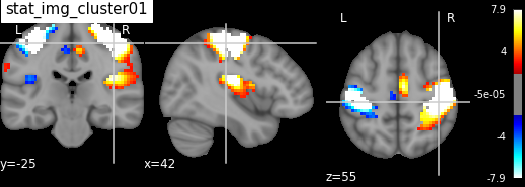

[](https://codecov.io/gh/miykael/atlasreader)
[](https://travis-ci.org/miykael/atlasreader)
[](https://github.com/miykael/atlasreader/issues/)
[](https://github.com/miykael/atlasreader/pulls/)
[](https://GitHub.com/miykael/atlasreader/graphs/contributors/)
[](https://github.com/miykael/atlasreader/commits/master)
[](https://github.com/miykael/atlasreader/archive/master.zip)
[](http://hits.dwyl.io/miykael/atlasreader)

# AtlasReader

This package provides a Python interface for generating coordinate tables and region labels from statistical MRI images.

If you are using `atlasreader` in your publication, please cite the following paper:

Markello R., Gale D., Herholz P., Whitaker K., & Notter M. P. (2019). AtlasReader: Quick generation of coordinate tables and region labels for statistical MRI images. *The Journal of Open Source Software*, ZZZ, YYY.

***TODO: This reference needs to be updated after paper is published. Don't forget to add the DOI and link to the paper.***

## Usage

`atlasreader` can either be run through the command line interface or directly within Python. The commands to do so are rather straight forward. Let's say you want to apply `atlasreader` to a statistical image called `file_name = 'stat_img.nii'`, and only want to keep clusters if they have more than 5 voxels:

#### Python
```python
from atlasreader import create_output
create_output(file_name, cluster_extent=5)
```

#### Command Line
```bash
atlasreader file_name 5
```


### Outputs

After executing `atlasreader` on a given image, four kinds of outputs are generated:

1. An **overview figure** that shows the results within the whole brain at once  
   

2. **For each cluster**, an **informative figure** showing the sagittal, coronal and transversal plane centered at this center of the cluster  
   

3. A **csv file** containing relevant information about the **peak** of each cluster. This table contains the location of each cluster's peak, it's signal value at this location, the cluster extent (in mm, not in number of voxels) and the atlas correspondence of the peak.

| cluster_id | peak_x | peak_y | peak_z | peak_value | volume_mm | aal             | desikan_killiany            | harvard_oxford                                    |
|------------|--------|--------|--------|------------|-----------|-----------------|-----------------------------|---------------------------------------------------|
| 1          | 42     | -25    | 55     | 7.94135    | 60399     | Postcentral_R   | Right-Cerebral-White-Matter | 48% Right_Postcentral_Gyrus; 12% Right_Precent... |
| 2          | -36    | -25    | 55     | -7.94144   | 19386     | Postcentral_L   | Left-Cerebral-White-Matter  | 30% Left_Postcentral_Gyrus; 30% Left_Precentra... |
| 3          | -15    | -52    | -26    | 7.94135    | 10260     | no_label        | Left-Cerebellum-Cortex      | 0% no_label                                       |
| 4          | 18     | -55    | -23    | -7.94144   | 8964      | Cerebelum_6_R   | Right-Cerebellum-Cortex     | 0% no_label                                       |
| 5          | -36    | -19    | 19     | -6.21808   | 1215      | Insula_L        | Unknown                     | 37% Left_Central_Opercular_Cortex; 37% Left_In... |
| 6          | -6     | -19    | 49     | -5.03538   | 1215      | Cingulate_Mid_L | ctx-lh-paracentral          | 50% Left_Precentral_Gyrus; 9% Left_Juxtapositi... |
| 7          | -30    | -10    | -2     | -4.65454   | 378       | Putamen_L       | Left-Putamen                | 98% Left_Putamen                                  |
| 8          | -15    | -55    | 16     | -3.57240   | 351       | Precuneus_L     | Left-Cerebral-White-Matter  | 35% Left_Precuneous_Cortex                        |
| 9          | -66    | -25    | 31     | 3.33892    | 351       | SupraMarginal_L | ctx-lh-supramarginal        | 42% Left_Supramarginal_Gyrus_anterior_division... |
| 10         | -21    | 41     | 46     | -3.41921   | 162       | Frontal_Sup_2_L | Unknown                     | 51% Left_Frontal_Pole; 19% Left_Superior_Front... |

4. A **csv** file containing relevant information about each **cluster**. This table contains the location of each cluster's peak, the mean value within the cluster, the cluster extend (in mm, not in number of voxels), as well as the membership of each cluster, given a particular atlas.

| cluster_id | peak_x | peak_y | peak_z | cluster_mean | volume_mm | aal                                               | desikan_killiany                                  | harvard_oxford                                    |
|------------|--------|--------|--------|--------------|-----------|---------------------------------------------------|---------------------------------------------------|---------------------------------------------------|
| 1          | 42     | -25    | 55     | 5.71861      | 60399     | 28.39% Postcentral_R; 14.75% Precentral_R; 9.1... | 31.47% Unknown; 27.09% Right-Cerebral-White-Ma... | 28.07% Right_Postcentral_Gyrus; 19.18% Right_P... |
| 2          | -36    | -25    | 55     | -5.92288     | 19386     | 60.17% Postcentral_L; 26.32% Precentral_L; 6.2... | 47.49% Left-Cerebral-White-Matter; 18.80% ctx-... | 60.58% Left_Postcentral_Gyrus; 35.38% Left_Pre... |
| 3          | -15    | -52    | -26    | 5.28665      | 10260     | 43.68% Cerebelum_6_L; 32.63% Cerebelum_4_5_L; ... | 76.05% Left-Cerebellum-Cortex; 19.21% Left-Cer... | 78.16% no_label; 10.53% Left_Lingual_Gyrus; 5.... |
| 4          | 18     | -55    | -23    | -4.93921     | 8964      | 32.53% Cerebelum_4_5_R; 31.02% Cerebelum_6_R; ... | 75.60% Right-Cerebellum-Cortex; 12.95% Right-C... | 81.93% no_label; 15.96% Right_Lingual_Gyrus       |
| 5          | -36    | -19    | 19     | -4.30705     | 1215      | 71.11% Rolandic_Oper_L; 28.89% Insula_L           | 46.67% Unknown; 28.89% ctx-lh-supramarginal; 1... | 57.78% Left_Central_Opercular_Cortex; 24.44% L... |
| 6          | -6     | -19    | 49     | -3.76954     | 1215      | 51.11% Cingulate_Mid_L; 37.78% Supp_Motor_Area... | 40.00% ctx-lh-paracentral; 31.11% Unknown; 15.... | 68.89% Left_Precentral_Gyrus; 20.00% Left_Juxt... |
| 7          | -30    | -10    | -2     | -3.67586     | 378       | 92.86% Putamen_L; 7.14% no_label                  | 100.00% Left-Putamen                              | 100.00% Left_Putamen                              |
| 8          | -15    | -55    | 16     | -3.21501     | 351       | 84.62% Precuneus_L; 7.69% Cuneus_L; 7.69% Calc... | 38.46% ctx-lh-precuneus; 38.46% Left-Cerebral-... | 100.00% Left_Precuneous_Cortex                    |
| 9          | -66    | -25    | 31     | 3.10147      | 351       | 84.62% SupraMarginal_L; 15.38% no_label           | 76.92% ctx-lh-supramarginal; 23.08% Left-Cereb... | 69.23% Left_Supramarginal_Gyrus_anterior_divis... |
| 10         | -21    | 41     | 46     | -3.18072     | 162       | 100.00% Frontal_Sup_2_L                           | 66.67% Unknown; 16.67% ctx-lh-superiorfrontal;... | 66.67% Left_Frontal_Pole; 33.33% Left_Superior... |


### Additional parameters

`atlasreader` has many additional parameters that allow you to change the way the clusters are generated and what kind of outputs are generated:

- **filename**: Niimg_like  
    A 3D statistical image.
- **cluster_extent**: int  
    Minimum number of contiguous voxels required to consider a cluster in `filename`
- **atlas**: str or list, optional  
    Name of atlas(es) to consider for cluster analysis. ***Default***: `'default'`
- **voxel_thresh**: int, optional  
    Threshold to apply to `stat_img`. If a negative number is provided a
    percentile threshold is used instead, where the percentile is
    determined by the equation `100 - voxel_thresh`. ***Default***: `1.96`
- **prob_thresh**: int, optional  
    Probability (percentage) threshold to apply to `atlas`, if it is
    probabilistic. ***Default***: `5`
- **min_distance**: float, optional  
    Specifies the minimum distance (in mm) required between sub-peaks in a
    cluster. If None, sub-peaks will not be examined and only the primary
    cluster peak will be reported. ***Default***: `None`
- **outdir**: str or None, optional  
    Path to desired output directory. If None, generated files will be
    saved to the same folder as `filename`. ***Default***: `None`
- **glass_plot_kws**: dict or None, optional  
    Additional keyword arguments to pass to `nilearn.plotting.plot_glass_brain`.
- **stat_plot_kws**: dict or None, optional  
    Additional keyword arguments to pass to `nilearn.plotting.plot_stat_map`.

For a more detailed explanation about the toolbox and the effect of the parameters above, see the [example notebook](https://github.com/miykael/atlasreader/blob/master/notebooks/atlasreader.ipynb).


## Installation

This package requires Python >= 3.6. Provided you have `pip` at your disposal, 
installing `atlasreader` is as simple as this:

```bash
pip install atlasreader
```

If you want to build `atlasreader` directly from source code, use the 
following code:

```bash
git clone https://github.com/miykael/atlasreader.git
cd atlasreader
python setup.py install
```


## How to get involved

We're thrilled to welcome new contributors!

If you're interested in getting involved, you should start by reading our [contributing guidelines](CONTRIBUTING.md).

Once you're done with that, you can take a look at our list of active [issues](https://github.com/rmarkello/pyls/issues) and let us know if there's something you'd like to begin working on.

If you've found a bug, are experiencing a problem, or have a question, create a new [issue](https://github.com/miykael/atlasreader/issues) with some information about it!


## Licence

`atlasreader` is licensed under the BSD-3 license; however, the atlases it uses 
are separately licensed under more restrictive frameworks.
By using `atlasreader`, you agree to abide by the license terms of the
individual atlases. Information on these terms can be found online at:
https://github.com/miykael/atlasreader/tree/master/atlasreader/data
